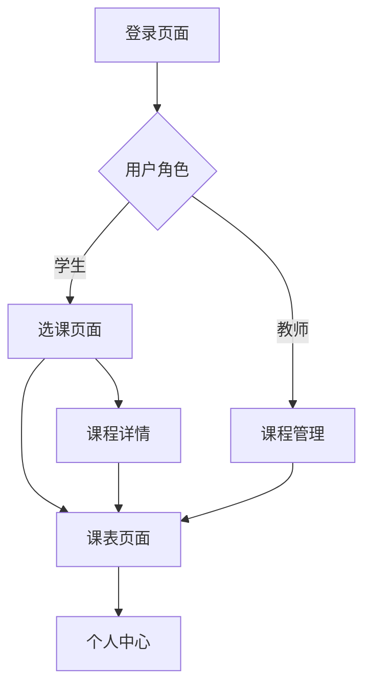

## 1. 产品概述
选课系统是一个简洁美观的教育管理工具，帮助教师管理课程信息，学生进行选课操作和查看个人课表。系统采用响应式设计，适配桌面端和移动端，通过REST API与后端服务集成。

目标用户为高校师生，解决传统选课流程繁琐、课表管理不便的问题，提供直观的课程管理和选课体验。

## 2. 核心功能

### 2.1 用户角色
| 角色 | 注册方式 | 核心权限 |
|------|----------|----------|
| 学生 | 学号+初始密码注册 | 浏览课程、选课退课、查看个人课表 |
| 教师 | 工号+初始密码注册 | 创建编辑课程、管理选课学生、查看选课情况 |
| 管理员 | 系统预设账号 | 用户管理、系统配置 |

### 2.2 功能模块
选课系统包含以下核心页面：
1. **登录/注册页面**：用户身份验证、账号注册
2. **课程管理页面**（教师）：课程创建编辑、学生管理
3. **选课页面**（学生）：课程浏览、选课退课操作
4. **课表页面**：个人课程时间表展示
5. **首页**：系统导航、个人信息概览

### 2.3 页面详情
| 页面名称 | 模块名称 | 功能描述 |
|----------|----------|----------|
| 登录页面 | 身份验证 | 输入用户名密码登录系统，支持记住登录状态 |
| 注册页面 | 账号注册 | 填写基本信息完成账号注册，验证学号/工号有效性 |
| 首页 | 导航菜单 | 显示用户角色对应的功能入口和个人信息 |
| 课程管理 | 课程列表 | 展示教师负责的所有课程，支持搜索和筛选 |
| 课程管理 | 课程编辑 | 编辑课程名称、描述、时间地点、容量等信息 |
| 课程管理 | 学生管理 | 查看选课学生列表，批准/拒绝选课申请 |
| 选课页面 | 课程浏览 | 展示所有可选课程，按分类和时间筛选 |
| 选课页面 | 选课操作 | 选择课程加入选课清单，查看课程详情 |
| 课表页面 | 时间表格 | 以周视图展示个人课程安排，支持时间冲突检测 |
| 个人中心 | 信息维护 | 修改个人信息、密码，查看选课历史 |

## 3. 核心流程

### 学生用户流程
学生访问系统 → 登录/注册 → 浏览可选课程 → 选择感兴趣的课程 → 系统检查时间冲突 → 成功选课后更新个人课表 → 可随时退课重新选择

### 教师用户流程
教师登录系统 → 创建新学期课程 → 设置课程详细信息 → 发布课程供学生选择 → 查看学生选课情况 → 管理选课学生名单

## 4. 用户界面设计

### 4.1 设计风格
- **主色调**：深蓝色 (#1e40af) 体现教育专业性
- **辅助色**：浅灰色 (#f8fafc) 和白色提供清晰对比
- **按钮样式**：圆角矩形设计，主要操作为实心填充，次要操作为边框样式
- **字体选择**：系统默认字体，标题16-18px，正文14px，小字12px
- **布局风格**：卡片式布局，顶部导航栏，内容区域居中显示
- **图标风格**：使用简洁的线性图标，保持视觉一致性

### 4.2 页面设计概述
| 页面名称 | 模块名称 | UI元素 |
|----------|----------|--------|
| 登录页面 | 表单区域 | 居中卡片设计，包含logo、输入框、登录按钮，背景使用渐变蓝色 |
| 首页 | 导航栏 | 顶部固定导航，包含用户头像、角色标识、主要功能入口 |
| 课程管理 | 课程卡片 | 网格布局展示课程，每张卡片显示课程名称、时间、已选人数 |
| 选课页面 | 筛选器 | 顶部筛选栏包含分类、时间、关键字搜索功能 |
| 课表页面 | 时间表格 | 周视图表格，不同课程使用颜色区分，支持拖拽调整 |
| 个人中心 | 信息卡片 | 分组展示个人信息、选课统计、操作记录 |

### 4.3 响应式设计
采用桌面端优先设计策略：
- **桌面端** (≥1024px)：完整功能展示，多列布局
- **平板端** (768px-1023px)：调整为两列布局，优化触摸操作
- **手机端** (<768px)：单列布局，底部导航栏，简化操作流程
- **触摸优化**：增大按钮点击区域，支持滑动操作，适配移动设备手势

### 4.4 交互细节
- 页面切换使用平滑过渡动画
- 表单输入实时验证反馈
- 操作成功/失败显示提示消息
- 加载状态显示骨架屏
- 空状态显示友好提示图标