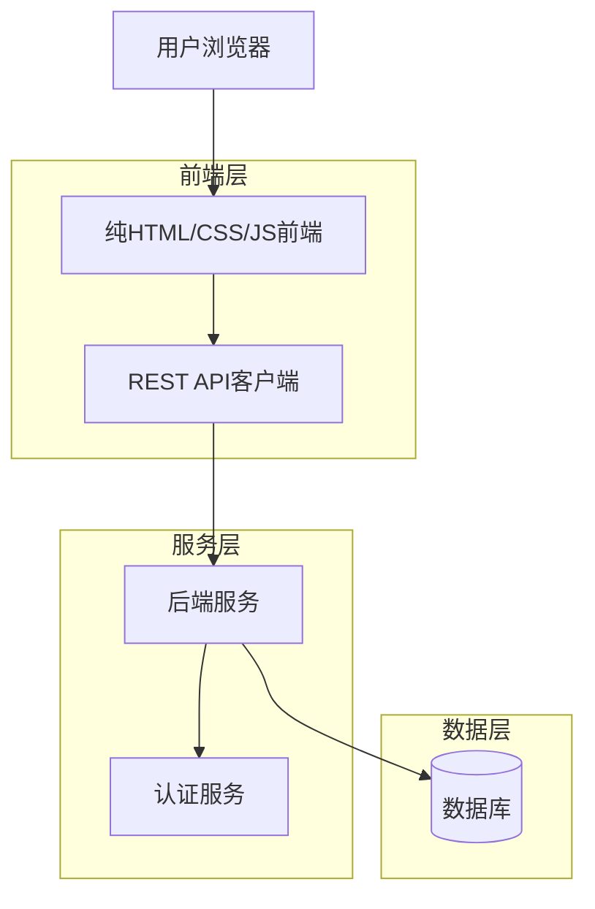

## 1. 架构设计



## 2. 技术描述

- **前端**: 纯HTML5 + CSS3 + ES6 JavaScript（无框架依赖）
- **构建工具**: 无需构建工具，直接使用原生Web技术
- **样式**: CSS Grid + Flexbox 实现响应式布局
- **状态管理**: 原生JavaScript模块化管理应用状态
- **路由**: 基于History API的单页应用路由
- **HTTP客户端**: 原生Fetch API实现RESTful通信
- **兼容性**: 现代浏览器支持（Chrome 60+, Firefox 55+, Safari 11+, Edge 79+）

## 3. 路由定义

| 路由 | 目的 |
|-------|---------|
| / | 登录页面，用户身份验证入口 |
| /dashboard | 首页，根据用户角色显示对应功能导航 |
| /courses | 课程列表页面，学生和教师共用但显示不同内容 |
| /course/:id | 课程详情页面，展示课程详细信息 |
| /schedule | 课表页面，显示个人课程时间安排 |
| /profile | 个人中心，用户信息和设置管理 |
| /logout | 退出登录，清除本地认证信息 |

## 4. API定义

### 4.1 认证相关API

**用户登录**
```
POST /api/auth/login
```

请求参数：
| 参数名 | 参数类型 | 是否必需 | 描述 |
|-----------|-------------|-------------|-------------|
| username | string | true | 学号或工号 |
| password | string | true | 用户密码 |
| role | string | true | 用户角色（student/teacher） |

响应示例：
```json
{
  "token": "eyJhbGciOiJIUzI1NiIsInR5cCI6IkpXVCJ9...",
  "user": {
    "id": "12345",
    "name": "张三",
    "role": "student",
    "email": "zhangsan@university.edu"
  }
}
```

**用户注册**
```
POST /api/auth/register
```

请求参数：
| 参数名 | 参数类型 | 是否必需 | 描述 |
|-----------|-------------|-------------|-------------|
| username | string | true | 学号或工号 |
| password | string | true | 用户密码 |
| name | string | true | 真实姓名 |
| email | string | true | 邮箱地址 |
| role | string | true | 用户角色 |

### 4.2 课程相关API

**获取课程列表**
```
GET /api/courses?role=student&semester=2024-1
```

查询参数：
| 参数名 | 参数类型 | 是否必需 | 描述 |
|-----------|-------------|-------------|-------------|
| role | string | false | 按角色筛选 |
| semester | string | false | 学期筛选 |
| category | string | false | 课程分类 |
| search | string | false | 搜索关键词 |

**创建课程**（教师）
```
POST /api/courses
```

请求参数：
| 参数名 | 参数类型 | 是否必需 | 描述 |
|-----------|-------------|-------------|-------------|
| name | string | true | 课程名称 |
| description | string | true | 课程描述 |
| credits | number | true | 学分 |
| capacity | number | true | 课程容量 |
| schedule | object | true | 上课时间安排 |

**学生选课**
```
POST /api/courses/:id/enroll
```

**学生退课**
```
DELETE /api/courses/:id/enroll
```

### 4.3 课表相关API

**获取个人课表**
```
GET /api/schedule?week=2024-W01
```

**获取选课学生列表**（教师）
```
GET /api/courses/:id/students
```

## 5. 前端架构设计

### 5.1 模块结构
```
src/
├── index.html          # 主入口文件
├── css/
│   ├── main.css        # 主样式文件
│   ├── responsive.css  # 响应式样式
│   └── components/     # 组件样式
├── js/
│   ├── app.js          # 应用主入口
│   ├── router.js       # 路由管理
│   ├── api.js          # API客户端
│   ├── auth.js         # 认证管理
│   ├── state.js        # 状态管理
│   └── components/     # UI组件
└── assets/
    ├── images/
    └── icons/
```

### 5.2 核心模块说明

**路由管理器 (router.js)**
- 监听URL变化，渲染对应页面
- 处理浏览器历史记录
- 实现页面切换动画

**API客户端 (api.js)**
- 封装Fetch API，统一错误处理
- 自动附加认证token
- 实现请求重试机制

**状态管理 (state.js)**
- 使用Proxy实现响应式状态
- 模块化管理应用数据
- 提供状态变更监听

**认证管理 (auth.js)**
- 处理登录/登出逻辑
- 管理token存储和刷新
- 权限验证和路由守卫

### 5.3 组件设计

**基础组件**
- Button: 按钮组件，支持不同样式和状态
- Input: 输入框组件，带验证功能
- Card: 卡片容器，统一阴影和圆角
- Modal: 模态框，支持动画效果

**业务组件**
- CourseCard: 课程卡片，显示课程基本信息
- ScheduleGrid: 课表网格，支持拖拽调整
- UserAvatar: 用户头像，显示在线状态
- SearchBar: 搜索栏，支持实时筛选

## 6. 数据模型

### 6.1 前端数据结构

**用户状态 (User State)**
```javascript
const userState = {
  isAuthenticated: false,
  user: {
    id: '',
    name: '',
    role: '', // 'student' | 'teacher'
    email: ''
  },
  token: '',
  permissions: []
};
```

**课程状态 (Course State)**
```javascript
const courseState = {
  courses: [],
  selectedCourse: null,
  filters: {
    category: '',
    semester: '',
    search: ''
  },
  loading: false,
  error: null
};
```

**课表状态 (Schedule State)**
```javascript
const scheduleState = {
  currentWeek: '',
  courses: [],
  timeSlots: [
    '08:00-09:40',
    '10:00-11:40', 
    '14:00-15:40',
    '16:00-17:40',
    '19:00-20:40'
  ],
  conflicts: []
};
```

### 6.2 本地存储设计

**localStorage 键值定义**
- `auth_token`: 用户认证token
- `user_info`: 用户基本信息
- `course_preferences`: 课程筛选偏好
- `schedule_view`: 课表显示偏好

**sessionStorage 键值定义**
- `current_route`: 当前路由状态
- `form_data`: 表单临时数据
- `search_history`: 搜索历史记录

## 7. 性能优化策略

### 7.1 代码优化
- 使用ES6模块实现代码分割
- 实现组件懒加载机制
- 使用事件委托减少DOM操作
- 缓存频繁使用的DOM查询

### 7.2 网络优化
- 实现API响应缓存
- 使用Service Worker实现离线支持
- 压缩静态资源文件
- 实现图片懒加载

### 7.3 渲染优化
- 使用DocumentFragment批量更新DOM
- 实现虚拟滚动处理长列表
- 使用CSS transform实现动画
- 避免强制同步布局

## 8. 错误处理

### 8.1 前端错误处理
- 全局错误捕获和上报
- API请求失败重试机制
- 网络断开时的优雅降级
- 表单验证错误提示

### 8.2 用户友好提示
- 操作成功/失败的Toast提示
- 网络加载中的Skeleton屏
- 404页面的友好引导
- 系统维护页面的说明